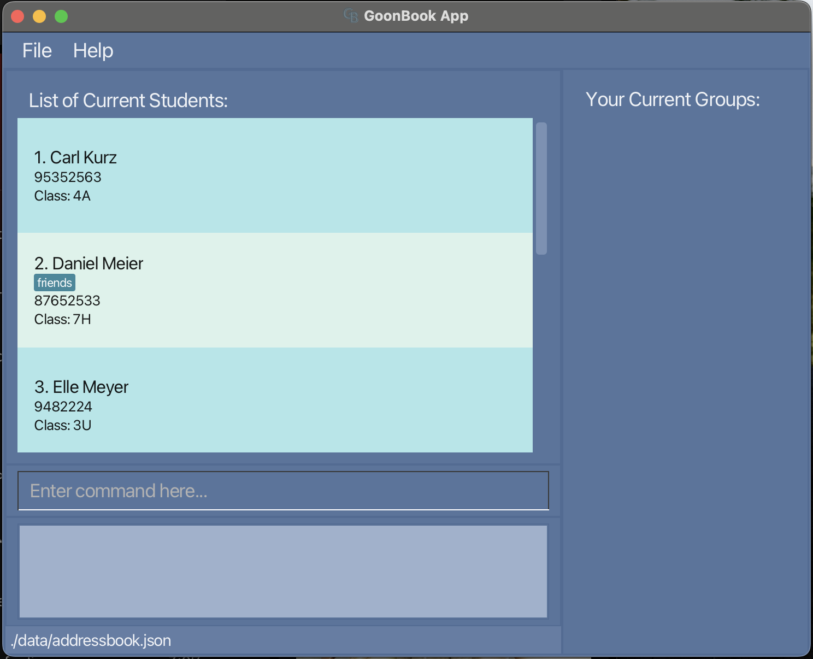
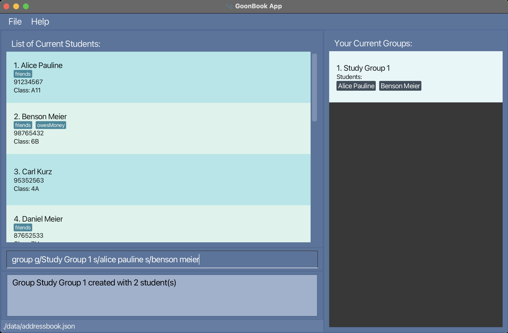
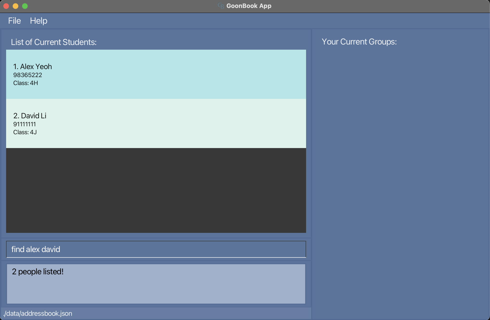

GoonBook Level 3 (AB3) is a **desktop app for managing students, optimized for use via a Command Line Interface** (CLI) while still having the benefits of a Graphical User Interface (GUI). If you can type fast, AB3 can get your contact management tasks done faster than traditional GUI apps.

## **Table of Contents**
1. [Quick start](#quick-start)
2. [Features](#features)
   1. [Viewing help](#viewing-help--help)
   2. [Adding a person](#adding-a-person-add)
   3. [Listing all persons](#listing-all-persons--list)
   4. [Editing a person](#editing-a-person--edit)
   5. [Grouping students together](#grouping-students-together-group)
   6. [Locating persons by name](#locating-persons-by-name-find)
   7. [Locating groups by name](#locating-groups-by-name-findgroup)
   8. [Adding a tag](#adding-a-tag-tag)
   9. [Deleting a tag](#deleting-a-tag-untag)
   10. [Deleting a person](#deleting-a-person-delete)
   11. [Deleting a group](#deleting-a-group-deletegroup)
   12. [Import students](#import-students-import-csv_file_location)
   13. [Export students](#export-students-export)
   14. [Clearing all entries](#clearing-all-entries--clear)
   15. [Exiting the program](#exiting-the-program--exit)
   16. [Saving the data](#saving-the-data)
   17. [Editing the data file](#editing-the-data-file)
   18. [Exported csv data file location](#exported-csv-data-file-location)
   19. [Archiving data files](#archiving-data-files-coming-in-v20)
3. [FAQ](#faq)
4. [Known issues](#known-issues)
5. [Command summary](#command-summary)

---

## Quick start

1. Ensure you have Java `17` or above installed in your Computer.

- If you are on MacOS do note you may need to download a specific JDK 17 version. More on this [here](https://nus-cs2103-ay2425s1.github.io/website/admin/programmingLanguages.html#programming-language).

1. Download the latest `.jar` file from [here](https://github.com/se-edu/addressbook-level3/releases).

1. Copy the file to the folder you want to use as the _home folder_ for your GoonBook.

1. Open a command terminal, `cd` into the folder you put the jar file in, and use the `java -jar goonbook.jar` command to run the application. 
   A GUI similar to the below should appear in a few seconds. Note how the app contains some sample data. 
   

   Examples:

   - cd /users/desktop/goonbook/goonbook.jar

1. Type the command in the command box and press Enter to execute it. e.g. typing **`help`** and pressing Enter will open the help window. 
   Some example commands you can try:

   - `list` : Lists all students.

   - `add n/Song Si Mew c/W08 p/10110011 t/Japanese` : Adds a student named `Song Si Mew` to the GoonBook.

   - `delete 1` : Deletes the 1st student shown in the current list.

   - `clear` : Deletes all students.

   - `exit` : Exits the app.

1. Refer to the [Features](#features) below for details of each command.

---

## Features

**:information_source: Notes about the command format:** 

- Words in `UPPER_CASE` are the parameters to be supplied by the user. 
  e.g. in `add n/NAME`, `NAME` is a parameter which can be used as `add n/John Doe`.

- Items in square brackets are optional. 
  e.g `n/NAME [t/TAG]` can be used as `n/John Doe t/friend` or as `n/John Doe`.

- Items with `…`​ after them can be used multiple times including zero times. 
  e.g. `[t/TAG]…​` can be used as ` ` (i.e. 0 times), `t/friend`, `t/friend t/family` etc.

- Parameters can be in any order. 
  e.g. if the command specifies `n/NAME p/PHONE_NUMBER`, `p/PHONE_NUMBER n/NAME` is also acceptable.

- Extraneous parameters for commands that do not take in parameters (such as `help`, `list`, `exit` and `clear`) will be ignored. 
  e.g. if the command specifies `help 123`, it will be interpreted as `help`.

- If you are using a PDF version of this document, be careful when copying and pasting commands that span multiple lines as space characters surrounding line-breaks may be omitted when copied over to the application.

### Viewing help : `help`

Shows a message explaning how to access the help page.

Format: `help`

### Adding a person: `add`

Adds a person to the address book.

Format: `add n/NAME c/CLASS p/PHONE_NUMBER [t/TAG]…​`

- Name of person is case-insensitive - same name but different casing is considered duplicate.

:bulb: **Tip:**
A person can have any number of tags (including 0)

Examples:

- `add n/Song Si Mew c/W08 p/10110011 t/Japanese`
- `add n/Aaron Tan c/G12 p/11110011 t/Trivial t/CS `

### Listing all persons : `list`

Shows a list of all persons in the address book.

Format: `list`

### Editing a person : `edit`

Edits an existing person in the address book.

Format: `edit INDEX [n/ NAME] [p/ PHONE] [c/ STUDENT CLASS] [t/TAG]…​`

- Edits the person at the specified `INDEX`. The index refers to the index number shown in the displayed person list. The index **must be a positive integer** 1, 2, 3, …​
- At least one of the optional fields must be provided.
- Existing values will be updated to the input values.
- When editing tags, the existing tags of the person will be removed i.e adding of tags is not cumulative.
- You can remove all the person’s tags by typing `t/` without
  specifying any tags after it.

Examples:

- `edit 1 p/91234567 c/ 4L` Edits the phone number and class of the 1st person to be `91234567` and `4L` respectively.

### Grouping students together: `group`

Groups students together.

Format: `group [g/GROUPNAME] [s/STUDENTNAME]…​`

- Each group must have a unique name.
- Only exact name matches will be added.
- Only the name is searched.

Examples:

- If the GoonBook contains `Bob` and `Tom` and a group called `Meow`
- `group g/StudyGroup1 s/Bob s/Tom` groups `Bob` and `Tom`
- `group g/Meow s/Bob s/Tom` returns `Group name already taken!!`
- `group g/Meow s/Bob s/` returns `Please do not enter an empty string for student name!`
- `group g/StudyGroup1 s/Bo` returns `The following students could not be found: Bo` 

### Locating persons by name: `find`

Finds persons whose names contain any of the given keywords.

Format: `find KEYWORD [MORE_KEYWORDS]`

- The search is case-insensitive. e.g `hans` will match `Hans`
- The order of the keywords does not matter. e.g. `Hans Bo` will match `Bo Hans`
- Only the name is searched.
- Only full words will be matched e.g. `Han` will not match `Hans`
- Persons matching at least one keyword will be returned (i.e. `OR` search).
  e.g. `Hans Bo` will return `Hans Gruber`, `Bo Yang`

Examples:

- `find John` returns `john` and `John Doe`
- `find alex david` returns `Alex Yeoh`, `David Li` 

### Locating groups by name: `findGroup`

Finds groups whose names contain any of the given keywords.

Format: `findGroup KEYWORD [MORE_KEYWORDS]`

- The search is case-insensitive. e.g `class` will match `Class`
- The order of the keywords does not matter. e.g. `class A` will match `A class`
- Only the group name is searched.
- Only full words will be matched e.g. `class` will not match `clas`
- Persons matching at least one keyword will be returned (i.e. `OR` search).
  e.g. `class` will return `class A`, `class B`

Examples:

- `findGroup 19S13` returns `19S13`
- `findGroup GroupA GroupB` returns `GroupA`, `GroupB 

### Adding a tag : `tag`

Adds a tag to a specified person.

Format: `tag INDEX t/TAG`

- Ability to add more than one tag at once by doing another `t/TAG` after.
- The index **must be a positive integer** 1, 2, 3, …​
- Tag is case-insensitive - same word but different casing is a duplicate.

### Deleting a tag : `untag`

Deletes a tag of a specified person.

Format: `untag INDEX t/TAG`

- Removes specified tag from that person.
- The index **must be a positive integer** 1, 2, 3, …​

### Deleting a person : `delete`

Deletes the specified person from the address book.

Format: `delete INDEX`

- Deletes the person at the specified `INDEX`.
- The index refers to the index number shown in the displayed person list.
- The index **must be a positive integer** 1, 2, 3, …​

Examples:

- `list` followed by `delete 2` deletes the 2nd person in the Goon book.
- `find Betsy` followed by `delete 1` deletes the 1st person in the results of the `find` command.

### Deleting a group : `deleteGroup`

Deletes the specified Group from the address book.

Format: `deleteGroup GROUPNAME`

- Deletes the group given the specific `GROUPNAME`.
- The group name refers to the name shown in the group list.

Examples:

- `groups` followed by `deleteGroup StudyGroup 1` deletes StudyGroup1

## Import students: `import CSV_FILE_LOCATION`

Imports and adds new NON-DUPLICATE students from a .csv file into GoonBook.

- Only adds NON-DUPLICATE students (students primary key is their name).
- Does not update existing users with the new imported data.
- Will notify user of all duplicate students found and not imported.
- Csv file location must be absolute path and valid.
- Csv files must be properly formatted to GoonBook style (see exported_data.csv).
- Csv files are to have 4 columns: `[name, class, phone number, tags]`.
- Tags in the csv file are to be seperated with a space.
- Will show user data corrupted error if parse or data is not formatted right.
- Will show user cannot find error if no or invalid file location is given.

Examples:
- `import /users/shaun/desktop/tp/test_students.csv`

## Export students: `export`

Exports all students in GoonBook to a .csv file.

Format: `export`

- Exports all students to fixed location as exported_data.csv
- Location can be found at `[JAR FILE LOCATION]/exported_data.csv`

### Clearing all entries : `clear`

Clears all entries from the address book.

Format: `clear`

### Exiting the program : `exit`

Exits the program.

Format: `exit`

### Saving the data

GoonBook data are saved in the hard disk automatically after any command that changes the data. There is no need to save manually.

### Editing the data file

GoonBook data are saved automatically as a JSON file `[JAR file location]/data/addressbook.json`. Advanced users are welcome to update data directly by editing that data file.

## Exported csv data file location

GoonBook csv data files are saved automatically as a .csv file at `[JAR file location/exported_data.csv]`.

:exclamation: **Caution:**
If your changes to the data file makes its format invalid, AddressBook will discard all data and start with an empty data file at the next run. Hence, it is recommended to take a backup of the file before editing it. 
Furthermore, certain edits can cause the AddressBook to behave in unexpected ways (e.g., if a value entered is outside of the acceptable range). Therefore, edit the data file only if you are confident that you can update it correctly.

### Archiving data files `[coming in v2.0]`

_Details coming soon ..._

---

## FAQ

**Q**: How do I transfer my data to another Computer? 
**A**: Install the app in the other computer and overwrite the empty data file it creates with the file that contains the data of your previous AddressBook home folder.

---

## Known issues

1. **When using multiple screens**, if you move the application to a secondary screen, and later switch to using only the primary screen, the GUI will open off-screen. The remedy is to delete the `preferences.json` file created by the application before running the application again.
2. **If you minimize the Help Window** and then run the `help` command (or use the `Help` menu, or the keyboard shortcut `F1`) again, the original Help Window will remain minimized, and no new Help Window will appear. The remedy is to manually restore the minimized Help Window.

---

## Command summary

| Action           | Format, Examples                                                                                                       |
| ---------------- |------------------------------------------------------------------------------------------------------------------------|
| **Add**          | `add n/NAME c/CLASS p/PHONE_NUMBER [t/TAG]…​`   e.g., `add n/James Ho p/22224444 c/4B t/friend t/colleague`         |
| **Clear**        | `clear`                                                                                                                |
| **Delete**       | `delete INDEX`  e.g., `delete 3`                                                                                    |
| **Delete Group** | `deleteGroup [g/GROUP_NAME]`   e.g., `deleteGroup g/studygroup1`                                                    |
| **Edit**         | `edit INDEX [n/NAME] [p/PHONE_NUMBER][c/CLASS] [t/TAG]…​`  e.g.,`edit 2 n/James Lee c/4L`                           |
| **Export**       | `export`                                                                                                               |
| **Find**         | `find KEYWORD [MORE_KEYWORDS]`  e.g., `find James Jake`                                                             |
| **Find Group**   | `findGroup [g/GROUP_NAME]`   e.g., `findGroup g/studygroup1`                                                        |
| **Delete Group** | `deleteGroup [g/GROUP_NAME]`   e.g., `deleteGroup g/studygroup1`                                                    |
| **Group**        | `group [g/GROUP_NAME] [s/STUDENT_NAMES]`   e.g., `group g/studygroup1 s/Annie s/Martin s/Jianbing s/Shaun s/Wenjie` |
| **Import**       | `import FILELOCATION`   e.g., `import /users/shaun/desktop/tp/test.csv`                                             |
| **List**         | `list`                                                                                                                 |
| **Tag**          | `tag [STUDENT_INDEX] [t/TAG_NAME]`   e.g., `tag 2 t/HighAchiever t/SecondTag`                                       |
| **Untag**        | `untag [STUDENT_INDEX] [t/TAG_NAME]`   e.g., `tag 2 t/HighAchiever t/SecondTag`                                     |
| **Help**         | `help`                                                                                                                 |
